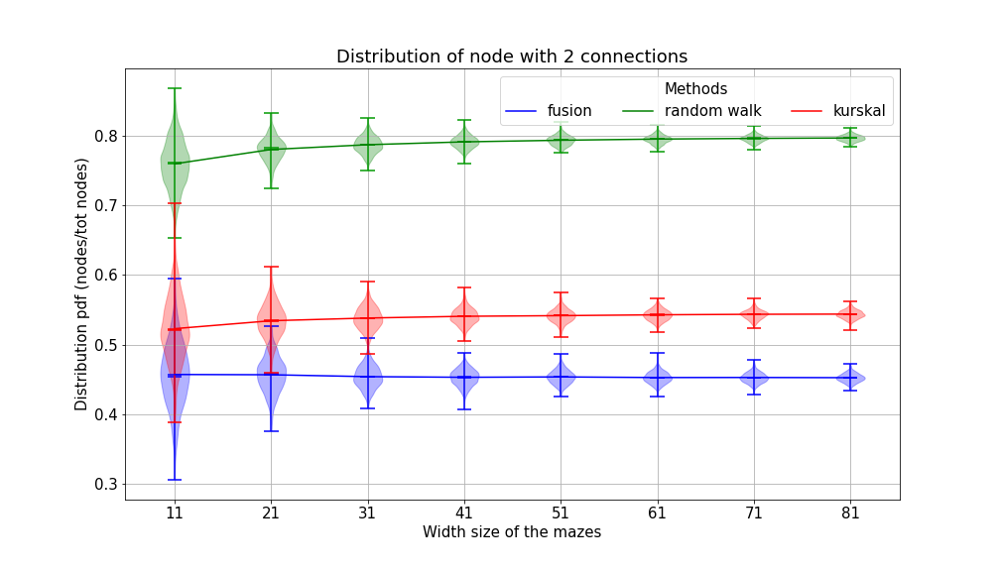

# Triangular-mesh
A set of function to create regularly spaced triangular mesh

There are two method to crate a mesh, which can be choose in the function **create_mesh**.

All the following actions can be applied on the mesh, regardless of the method used.

There are two method to create maze from the created mesh. The 'fusion' method with **maze_fusion**. The 'exploration' method with **maze_exploration**.

In the following plots, the blue dots are the nodes. The blue lines are the connections between the nodes. The broken purpule line is a path between two nodes.

There are two method to solve the created maze. The 'gradient' method with **Dijkstra_triangular_mesh** and **optimal_path** which will compute the shortest path. The 'right' or 'left hand' method with **hand_solving** which will find a path by following a wall.

For the creation of height map, you can applie noise on the node as initial heigth. Then use **lin_smooth** or **kernel_smooth** to smooth this random height.

## Analysis of labyrinths created
Distribution of nodes with one (dead end), two, three, four, five and six connections. The test was done by creating 1 000 random mazes for each method and eache maze size.

## Time consumtion
Time took to create maze depends of their size and of the algorithm as we can se on the figure below:
(The test was done by creating 1 000 random mazes for each method and eache maze size).

